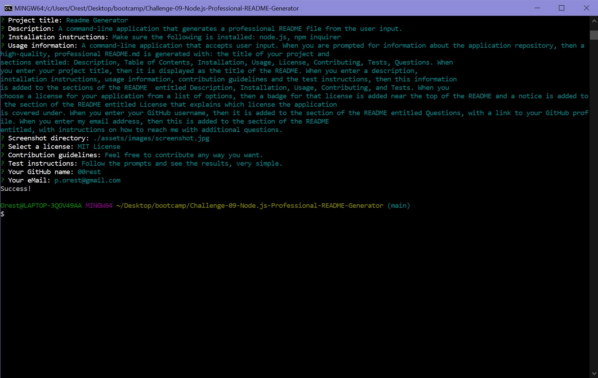

# Readme Generator
  

## Description
A command-line application that generates a professional README file from the user input.

## Table of Contents:
- [Description](#description)
- [Installation](#installation)
- [Usage](#usage)
- [License](#license)
- [How to Contribute](#how-to-contribute)
- [Tests](#tests)

## Installation
Make sure the following is installed: node.js, npm inquirer

## Usage
A command-line application that accepts user input. When you are prompted for information about the application repository, then a high-quality, professional README.md is generated with: the title of your project and sections entitled: Description, Table of Contents, Installation, Usage, License, Contributing, Tests, Questions. When you enter your project title, then it is displayed as the title of the README. When you enter a description, installation instructions, usage information, contribution guidelines and the test instructions, then this information is added to the sections of the README  entitled Description, Installation, Usage, Contributing, and Tests. When you choose a license for your application from a list of options, then a badge for that license is added near the top of the README and a notice is added to the section of the README entitled License that explains which license the application is covered under. When you enter your GitHub username, then it is added to the section of the README entitled Questions, with a link to your GitHub profile. When you enter my email address, then this is added to the section of the README entitled, with instructions on how to reach me with additional questions.

[Walktrough video](./assets/video/walktrough.webm)

## License
MIT License

https://spdx.org/licenses/MIT.html

## How to Contribute
Feel free to contribute any way you want.

## Tests
Follow the prompts and see the results, very simple.

## Questions
If you have any questions, you can reach me at:

Email: p.orest@gmail.com

or

GitHub: https://github.com/00rest

